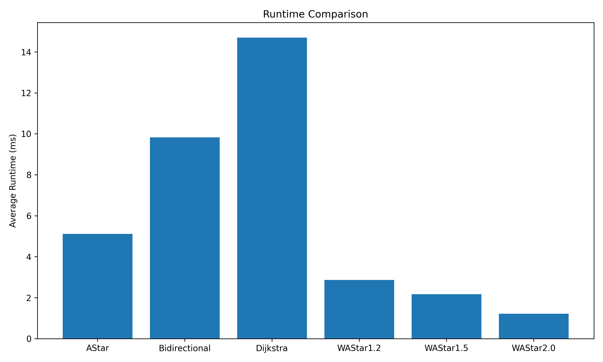
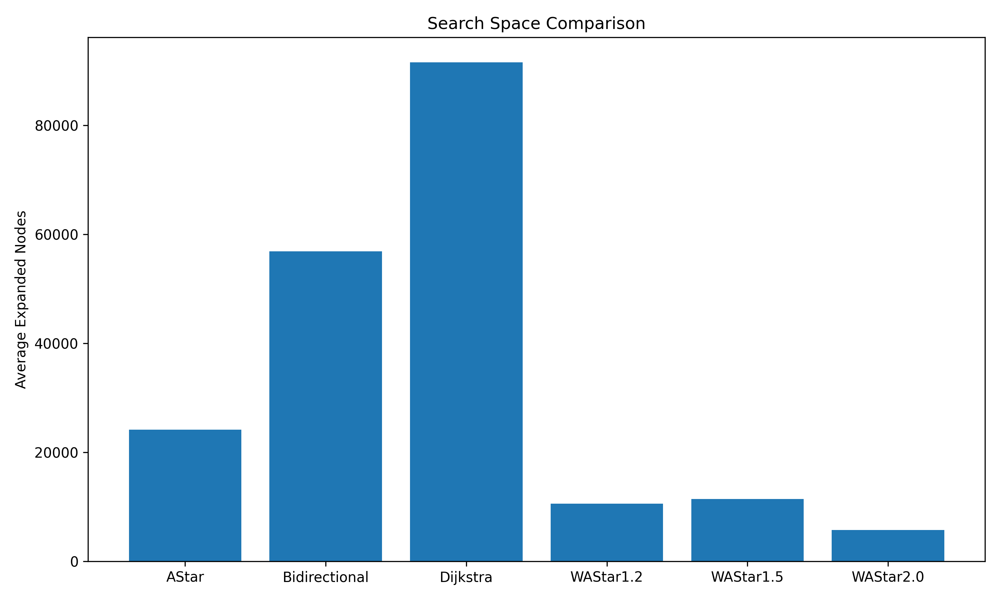
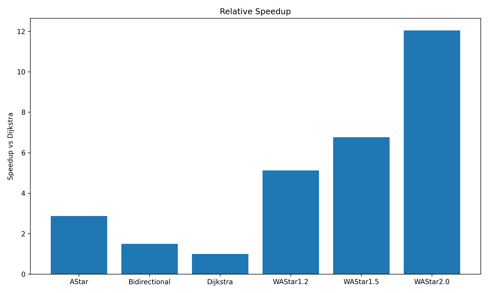
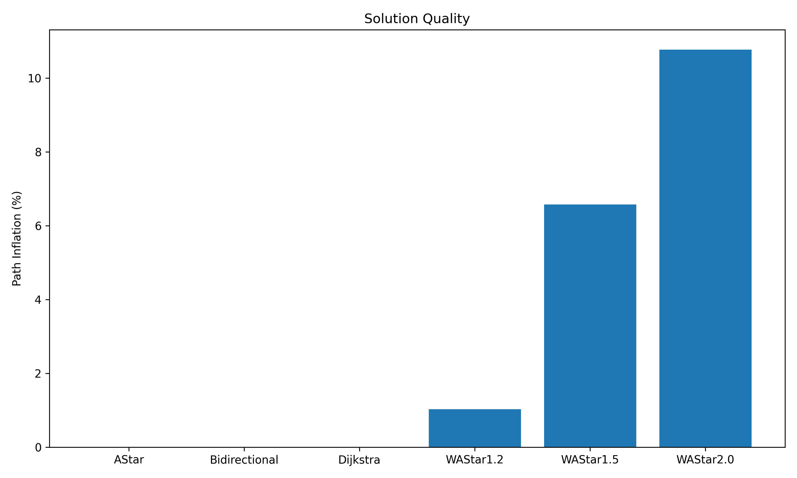

# Graph Pathfinding Engine

<p align="center">


</p>

A high-performance **C++17 routing engine** implementing classical and heuristic shortest-path algorithms on a real-world **OpenStreetMap (OSM)** road network. The project benchmarks multiple graph search algorithms, analyzes their performance trade-offs, and provides interactive visualization of computed routes and search frontiers.

---

# Features

* Road network built from **OpenStreetMap (OSM)** data.
* Efficient adjacency-list graph representation.
* Implements multiple shortest-path algorithms:

  * Dijkstra's Algorithm
  * A* Search
  * Bidirectional Dijkstra
  * Weighted A*
* Haversine-distance heuristic for geospatial routing.
* Automated benchmarking framework over random routing queries.
* Interactive route visualization using Folium.
* Search frontier export for algorithm comparison.
* Python utilities for benchmark analysis and visualization.

---

# Project Overview

Unlike toy graph implementations, this project performs routing on a **real road network** containing nearly **200,000 intersections** and **half a million road connections**. It demonstrates the practical differences between uninformed and heuristic graph search algorithms by comparing execution time, explored search space, and path quality.

---

# Dataset

The road network is generated from **Delhi OpenStreetMap** data.

| Property             |                             Value |
| -------------------- | --------------------------------: |
| Nodes                |                       **183,747** |
| Directed Edges       |                       **499,345** |
| Edge Weight          | Great-circle distance (Haversine) |
| Graph Representation |                    Adjacency List |

> **Note:** The processed dataset is intentionally excluded from the repository due to GitHub's file size limits. It can be regenerated using the provided preprocessing scripts.

---

# Implemented Algorithms

| Algorithm              |   Optimal   | Heuristic |
| ---------------------- | :---------: | :-------: |
| Dijkstra               |      ✅      |     ❌     |
| A*                     |      ✅      |     ✅     |
| Bidirectional Dijkstra |      ✅      |     ❌     |
| Weighted A*            | Approximate |     ✅     |

---

# Architecture

```text
                 OpenStreetMap Data
                         │
                         ▼
                Graph Preprocessing
                         │
                         ▼
              Adjacency List Graph
                         │
        ┌────────────────┼────────────────┐
        ▼                ▼                ▼
    Dijkstra           A* Search    Bidirectional
                         │
                         ▼
                  Weighted A*
                         │
                         ▼
              Benchmark Framework
                         │
                         ▼
     CSV Results • Performance Plots • Route Visualization
```

---

# Performance Benchmark

The benchmark executes **100 randomly generated routing queries** on the Delhi road network.

| Algorithm              | Avg Time (ms) | Avg Expanded Nodes | Avg Distance (m) |
| ---------------------- | ------------: | -----------------: | ---------------: |
| Dijkstra               |         14.70 |             91,548 |           21,507 |
| Bidirectional Dijkstra |          9.82 |             56,844 |           21,507 |
| A*                     |          5.11 |             24,157 |           21,507 |
| Weighted A* (ε = 1.2)  |      **2.87** |         **10,586** |           21,729 |
| Weighted A* (ε = 1.5)  |          2.17 |             11,445 |           22,921 |
| Weighted A* (ε = 2.0)  |      **1.22** |          **5,750** |           23,823 |

---

# Key Insights

* **A*** reduced explored nodes by **73.6%** compared to classical Dijkstra while preserving optimal shortest paths.
* **Weighted A* (ε = 1.2)** achieved approximately **5× faster execution** with only **1.03% path inflation**.
* **Weighted A* (ε = 2.0)** achieved approximately **12× speedup**, demonstrating the trade-off between execution time and route optimality.

---

# Benchmark Visualizations

## Runtime Comparison

<p align="center">

</p>

---

## Search Space Comparison

<p align="center">

</p>

---

## Speedup over Dijkstra

<p align="center">

</p>

---

## Path Quality Trade-off

<p align="center">

</p>

---

# Interactive Route Visualization

The project exports the shortest paths and explored search frontiers for every implemented algorithm, enabling interactive visualization on real OpenStreetMap road networks.

<p align="center">

</p>

The visualization supports:

* Comparison of shortest paths.
* Search frontier inspection.
* Source and destination markers.
* Interactive zoom and pan.

---

# Repository Structure

```text
graph-pathfinding-engine/

├── include/
├── src/
├── benchmark/
├── scripts/
├── assets/
├── data/
│   ├── raw/
│   └── processed/
├── results/
├── CMakeLists.txt
├── README.md
└── LICENSE
```

---

# Building

```bash
mkdir build
cd build

cmake -G "MinGW Makefiles" ..
mingw32-make
```

---

# Running

### Generate Route

```bash
./pathfinder
```

Exports:

* route CSVs
* search frontier CSVs

---

### Benchmark

```bash
./benchmark
```

Outputs benchmark statistics and generates CSV summaries.

---

### Generate Benchmark Plots

```bash
cd scripts

python benchmark.py
```

---

### Interactive Visualization

```bash
python comparison.py
```

Produces an interactive HTML visualization inside the `results/` directory.

---

# Technologies Used

* **C++17**
* **CMake**
* **STL**
* **Python**
* **Pandas**
* **Matplotlib**
* **Folium**
* **OpenStreetMap**

---

# Future Enhancements

* Search frontier animation
* Interactive algorithm selector
* ALT (A* with Landmarks)
* Contraction Hierarchies
* Dynamic traffic-aware routing
* Turn penalty modelling
* Parallel shortest-path search

---

# Acknowledgements

* OpenStreetMap contributors for the road network data.
* Folium and Matplotlib for visualization support.

---

# License

This project is licensed under the **MIT License**.
